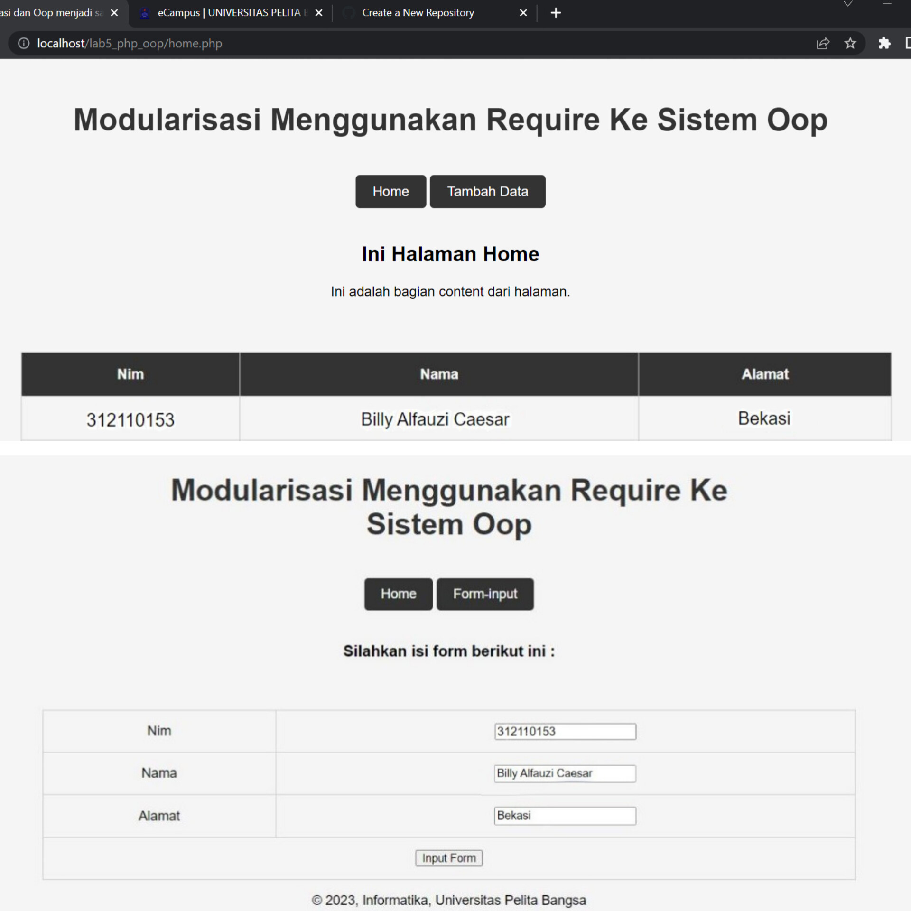
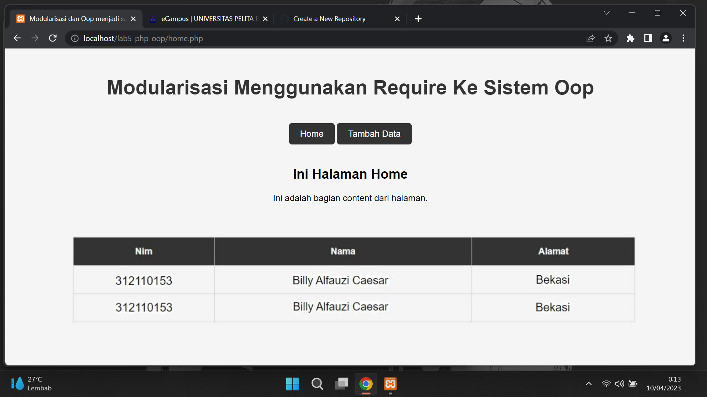

# Tugas Pemrograman Web 2
## Profile
<body>
    <table border="1">
        <tr>
            <th> Nama</th>
            <th>NIM</th>
            <th>Kelas</th>
        </tr>
        <tr>
            <td>Billy Alfauzi Caesar</td>
            <td>312110152</td>
            <td>TI.21.A.1</td>
        </tr>
    </table>
</body>

## Pertanyaan & Tugas
- Implementasikan konsep modularisasi pada kode program pada praktukum sebelumnya dengan menggunakan class library untuk **form** dan **database** connection.

## Beginning
- Pertama siapkan Text Editor semisal VSC, SublimeText. ```(Up to You)```
- Buat Folder baru dengan nama lab5_php_oop di htdocs
- Kemudian Masukkan semua File-File perintah Yang ada pada folder Praktikum_5

## Run Program



## Menambah Data pada Program




## Done

# Panjang Umur Untuk Semua Hal-Hal Baik
